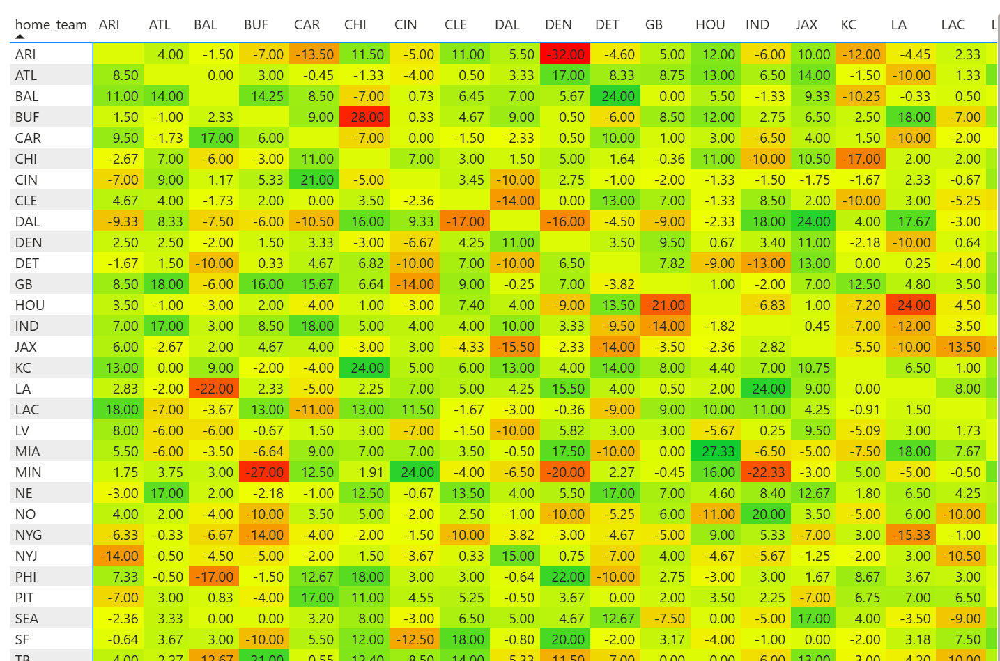
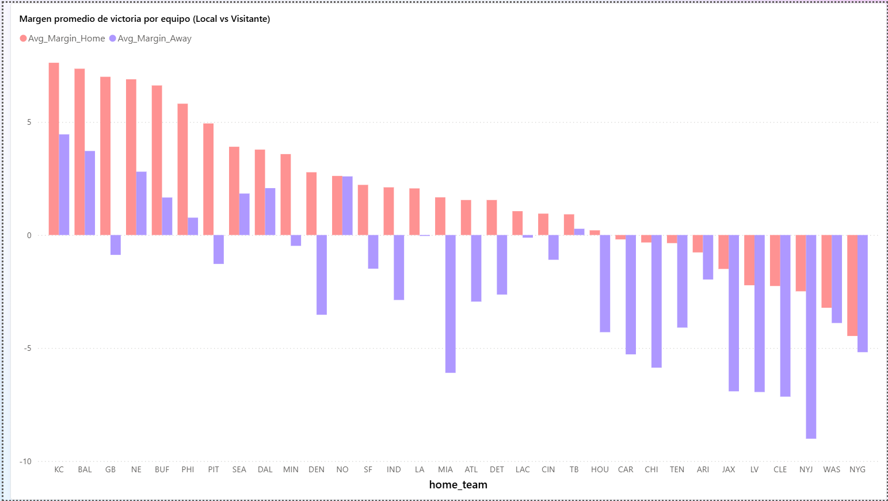
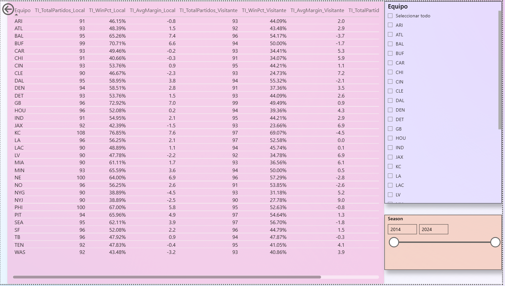

# NFL Halftime Margin Analysis 

Este proyecto analiza la **probabilidad de ganar y de comeback en partidos de la NFL** en función del margen al medio tiempo.

## Objetivos
- Estimar probabilidades de victoria del equipo líder al descanso.
- Analizar frecuencia de comebacks según el margen.
- Construir un dashboard interactivo en Power BI para explorar los datos.

## Herramientas
- Power BI Desktop
- DAX para crear medidas personalizadas
- Visualizaciones interactivas

## 📸 Vista previa

## 📂 Archivos en este repo
- `NFL_Margin_Analysis.pbix` → Archivo de Power BI con el dashboard completo.
- `NFL_Margin_Analysis.pdf` → Exportación en PDF.
- `images/` → Capturas de las visualizaciones.

## 🚀 Cómo usar
1. Descargar el archivo `.pbix`.
2. Abrir en **Power BI Desktop**.
3. Explorar el dashboard interactivo.

---
👤 Autor: *Tu Nombre*  
📅 Año: 2025

